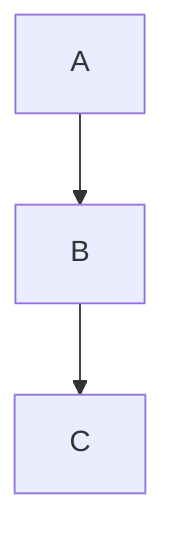
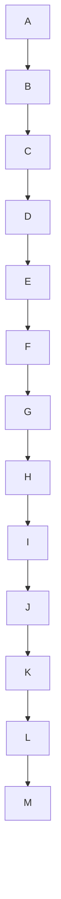

## 1. Explicit true, simple → ON

```mermaid {fullscreen=true}
flowchart TD
  A --> B
  B --> C
```

## 2. Explicit auto, dense → ON

```mermaid {fullscreen=auto}
flowchart TD
  A --> B
  B --> C
  C --> D
  D --> E
  E --> F
  F --> G
  G --> H
  H --> I
  I --> J
  J --> K
  K --> L
  L --> M
```

## 3. Site-default auto, dense → ON

```mermaid
flowchart TD
  A --> B
  B --> C
  C --> D
  D --> E
  E --> F
  F --> G
  G --> H
  H --> I
  I --> J
  J --> K
  K --> L
  L --> M
```

## 4. Site-default auto, simple → OFF

```mermaid
flowchart TD
  A --> B
  B --> C
```

## 5. Explicit false, dense → OFF

```mermaid {fullscreen=false}
flowchart TD
  A --> B
  B --> C
  C --> D
  D --> E
  E --> F
  F --> G
  G --> H
  H --> I
  I --> J
  J --> K
  K --> L
  L --> M
```
